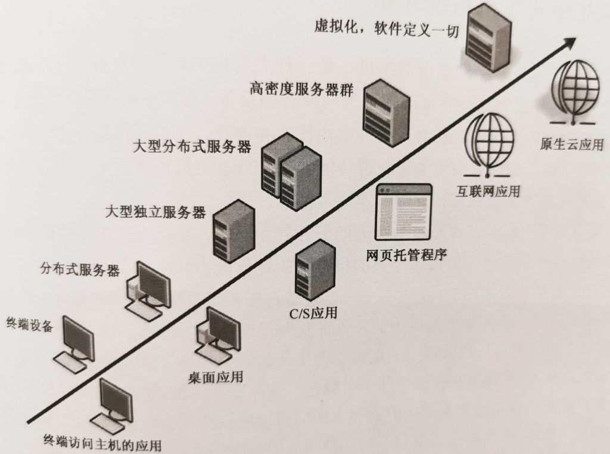
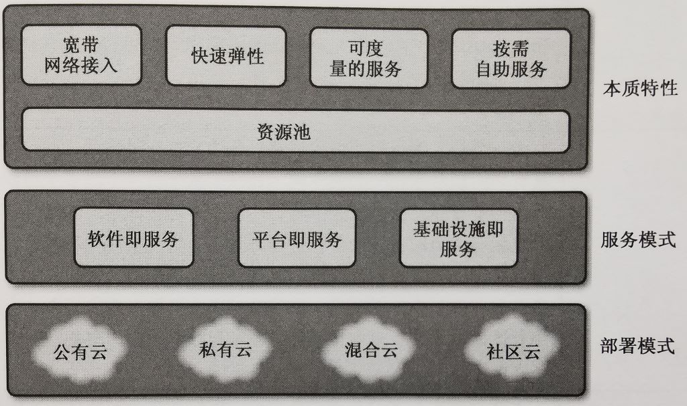
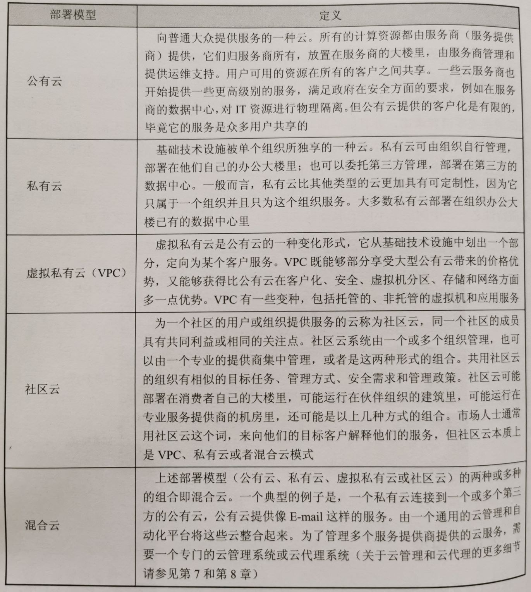
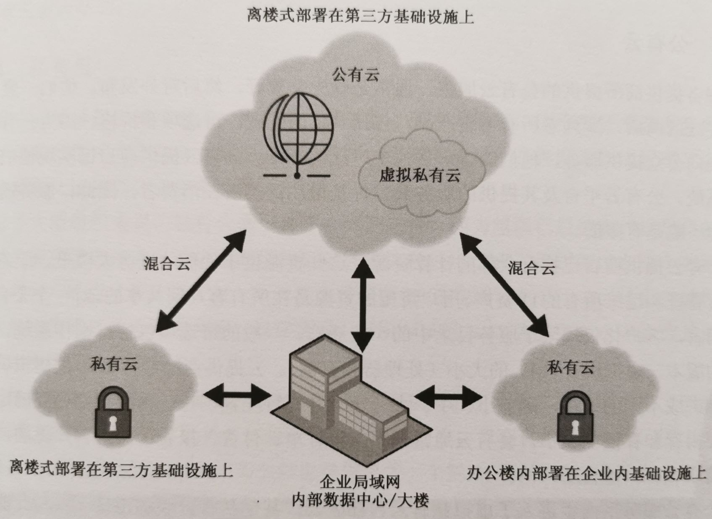
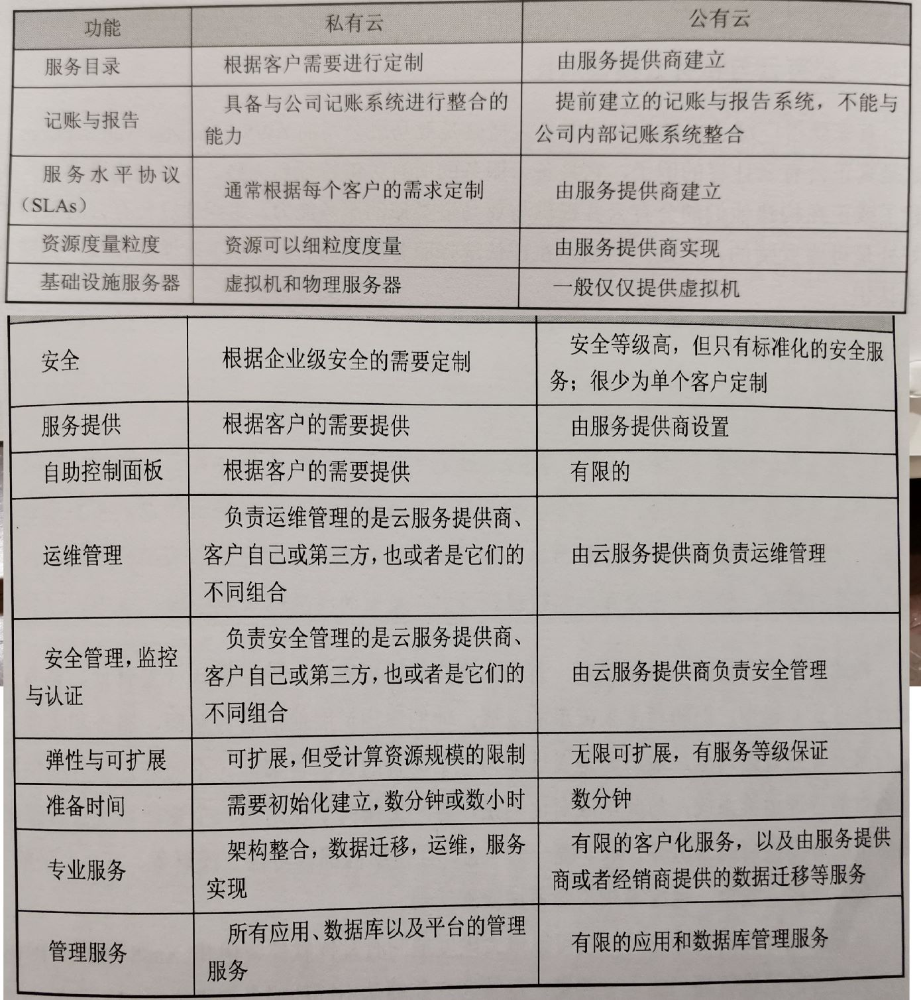
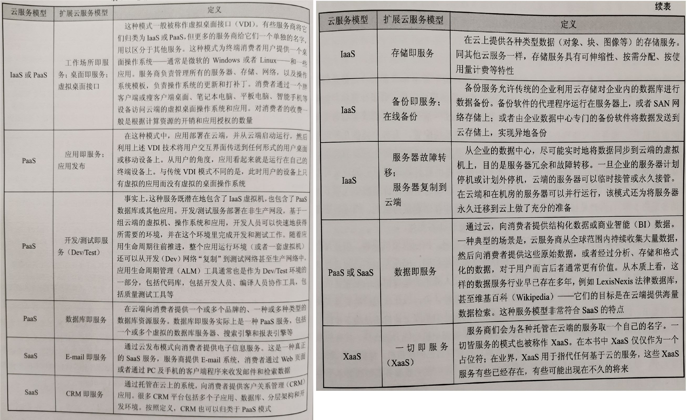
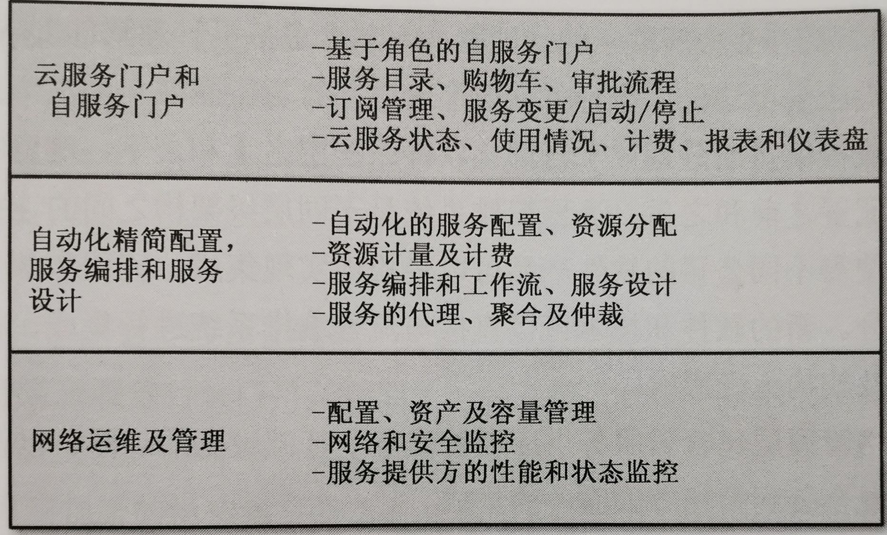
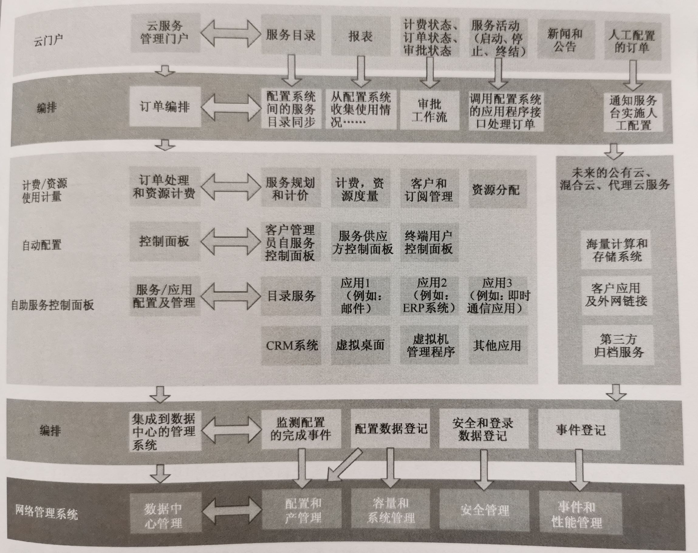
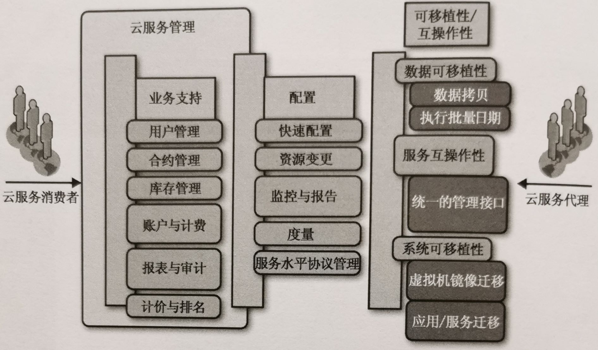

# Cloud Computing 云计算、云服务

美国国家标准与技术委研究院（ NIST ）关于云的定义是这样描述的：
云计算是一种便利的、按需分配的计算资源（例如，网络、服务器、存储、应用，以至及服务等）获取模式，即用户通过网络从远程的、共享的、可配置的资源池中快速地获取和释放计算资源。在这种模式中，用户所需付出的管理成本降到最低，与云服务提供商之间的交互也降到了最低。 

## 云计算的作用

降低企业 IT 成本、发挥 IT 资源利用率、增加业务灵活性、提升系统可维护性、弹性可伸缩、按实际使用量付费等。

## 云计算的演变

2016 年是云计算爆发之年。

云计算就像我们使用水电煤气一样，按照需求购买。

软件定义数据中心（SDDC），通过将服务器、网络、存储虚拟化，实现 IT 基础设施的灵活配置。所有这些基础设施服务都是池化的，并都由云管理平台统一管理。

# 云计算的模型

## 云部署模式

### 公有云

- 大多数的主流公有云服务提供商，例如亚马逊 AWS，起初都是专注于提供 IaaS（基础设施即服务），包括 VMs（虚拟机）服务，以及 CDN（内容发布网络）服务等。每个公有云服务商都具有提供 IaaS 服务的能力。
- 然后，这些服务提供商开始增加 PaaS（平台即服务）、SaaS（软件即服务，如微软的 Office 365、Google APPs）。
- 现在，针对万物互联、AIoT、AI 等，开始增加物联网平台服务（从设备端到主机端到云端，再到信息安全、存储、分析、AI 自力等，提供完整的服务链）。

### 私有云

私有云的主要优势是定制化，包括采购管理、安全管理 、运维管理、报告以及政府流程的定制化等。

大多数客户，尤其是大一些的组织和政府实体，随着需求讨论的深入、定制化、安全、以及其他方面的需求逐渐清晰，私有云更加符合他们的需求。

### 混合云

下一代云部署模型：混合云。客户自己拥有和运维着私有云——即已经完成现代化改造的遗留数据中心——并利用私有云管理平台软件，有选择地将一些服务托管到第三方公有云上（并可以管理公有云上的 XaaS 服务）。

对于小型企业，没有内部 IT 部门，建设私有云是几乎不可能的（成本太高，维护难度大等），这些小型企业更倾向于通过互联网访问公有云。

### 私有云 vs 公有云

## 云服务模式

云服务的第一法则是 “一切” 自动化。对自动化的不懈追求带来运维的高效性、配置的一致性、按需快速交付、弹性地横向或纵向扩展、以及运维成本的节省。

### 基础设施即服务（laaS）

- 一种以虚拟机(vm)形式存在的，包括计算能力、内存、存储和网络在内的服务。
- 消费者可以根据他们的喜好部署操作系统和应用。云服务商通常会提供操作系统(OS）模板，消费者可以在这个基础上实现快速部署。
- 服务商还会负责系统层面的所有管理工作，包括服务器，网络，存储系统，虚拟化层等；消费者负责管理操作系统，应用，以及应用数据。数据的备份、恢复服务，长期数据的保存等服务，大多服务商也都提供。
- 服务计价通常是根据处理器、内存、存储和网络资源的数量。
- 由于这些资源能够根据实际需求自动调整分配（可伸缩），因此消费者只需根据资源的实际开销付费。

### 软件即服务（SaaS）

- 一种向消费者提供一种或多种应用的服务。
- 应用软件部署在服务商的云端，由服务商管理，消费者通过各种类型的终端设备获取应用软件的功能服务。
- 例如，从 PC、平板、笔记本电脑、智能手机或者通过浏览器访问云端的应用。
- 消费者无需管理底层的服务器，应用程序或者存储。
- 服务商或许为消费者提供一个 web 版的自助控制面板，消费者可以通过这个面板对应用的某些特性或参数进行设置。
- 服务计价通常是根据用户授权的数量，也有针对额外存储空间或者高级应用特性进行另外计价的。

### 平台即服务(PaaS）

- 一种提供一系列应用和工具的服务，通常是由一组虚拟机 (VM) 构成的。
- 服务商负责管理底层的虚拟机、网络、存储、操作系统和核心应用程序。
- PaaS 与 laaS 很像，但是作为“平台”，通常更复杂，与单纯的虚拟机相比，它还包括一系列系统层软件和应用层软件。
- 云服务商不仅要负责虚拟机，还要负责应用、工具和资源。
- 服务商可能提供一个基于web的自助控制面板，消费者可以在这个控制面板上对应用进行某些特性的设置。
- 服务的计价一般综合考虑了计算资源或基础架构的成本，数据库应用的授权，用户授权，以及额外存储或高级应用特性等。

### 一切即服务（XaaS）

- 随着云计算行业的发展，更多“一切即服务”的模式（简称 XaaS）被创造出来。
- 大多数这些新的 XaaS 模式，实际上都可以归结为上述三种核心定义之一。

### 扩展云服务模式

## 云服务的管理

# 物联网云平台、云服务、云计算

