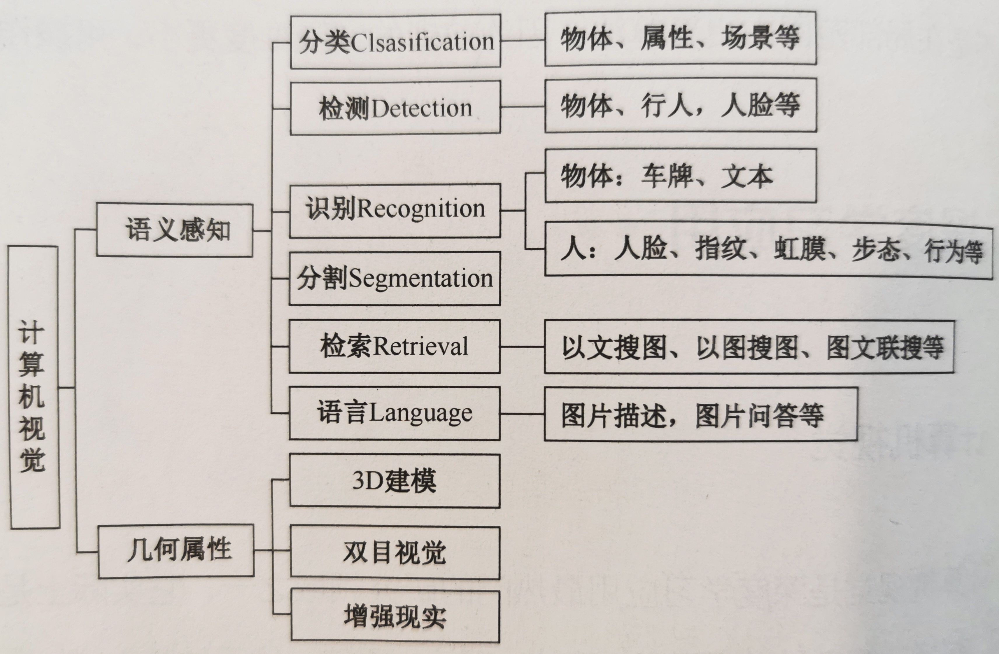

# Deep Learning 深度学习

# 深度学习

## 深度学习的发展过程

AI 之父——马文 · 明斯基。他证明单层感知器无法解决线性不可分问题（如异或问题）。单层感知器的致命缺陷导致无法将它推广到多层神经网络中，人工智能神经网络在 20 世纪 70 年代进入了第一个瓶颈期。此后近 20 年，人们对神经网络都没有新的发现。

深度学习之父——杰弗里 · 辛顿。提出了 BP（Back Propagation）算法，它适用于多层感知器的反向传播。即，BP 算法以传统神经网络的正向传播为基础，增加了误差的反向传播过程。反向传播过程不断地调整神经元之间的权值和阈值，直到输出的误差减小到允许的范围内，或达到预先设定的训练次数为止。BP 算法完美地解决了非线性分类问题，使人工神经网络研究再次回暖。由于当时计算机性能有限，在神经网络的规模不断增大的情况下，BP 算法会直接导致 “梯度消失” 问题，使 BP 算法得不到进一步发展。

20 世纪 90 年代中期，以 SVM（支持向量机，Support Vector Machine）为代表的其他浅层机器学习算法被提出，解决了一定的分类、回归问题。但算法的原理与神经网络模型有着明显的不同，人工神经网络的发展，不得不再次停滞，并再一次进入了寒冬期。


2006 年杰弗里 · 辛顿和他的学生鲁斯兰 · 萨拉赫丁诺夫正式提出了深度学习的概念。给出了 “梯度消失” 问题的详细解决方案——通过无人监控的学习方法逐层训练算法，然后使用有监督功能的反向传播算法进行参数调优。在 2006 年，深度学习理论被提出后 ，卷积神经网络的表征学习能力得到了关注。

2016 年，谷歌公司基于深度学习开发的 AlphaGo 以 4:1 的比分战胜了国际顶尖围棋高手李世石。

2017 年，基于强化学习算法的升级版 AlphaGo Zero 采用 “从零开始”、“无师自通” 的学习模式，以 100:0 的比分完胜 AlphaGo。2017 年是人工智能发展突飞猛进的一年。人工智能正在悄无声息地改变着我们的生活！


第三拨的人工智能热潮源于深度学习的复兴。


## 深度学习 与 机器学习

机器学习是人工智能的一个分支。而深度学习是机器学习的一个分支。

实现机器学习的途径一般包括决策树、归纳逻辑程序设计、聚类、强化学习、贝叶斯网络等，而深度学习是另外一种途径。深度学习这一概念的灵感来自大脑的结构和功能，即众多神经元的相互连接。

通过实验所实现的的人工神经网络（ANN）实际上是一种模拟大脑生物结构的算法。在人工神经网络中，存在着具有独立处理层的神经元。其中，每一个独立处理层都有其特定的学习特征。例如，自动地对图像中的曲线或边缘进行识别。正是这种分层的属性，定义了 “深度学习” 这一名称。

深度学习是人工神经网络或者深层神经网络的代名词，“深度” 指的是神经网络的网络层次，是通过使用多个独立层（而不是单个的独立层）来实现的。

典型的深度学习模型是指具有 “多隐藏层（指具有三个以上的隐藏层）” 的神经网络。深度学习模型通常有 8 层、9层，甚至更多的隐藏层，这意味着深度学习模型可以自动提取很多复杂的特征。

随着云计算、大数据时代的到来，海量的训练数据配合逐层预训练、误差逆传播微调的方法，可以大幅提高模型的训练效率，同时降低过拟合的风险。


相比而言，传统的机器学习算法，很难对原始数据进行处理，通常需要人为地从原始数据中提取特征。需要系统设计者对原始数据有相当专业的认识，在获得比较好的特征表示后，需要设计一个对应的分类器，使用相应的特征对问题进行分类。

而深度学习是一种自动提取特征的学习算法，无须考虑烦琐的特征提取过程，一旦设计好网络框架，就能解决问题，节省了大量的特征提取时间。通过多层次的非线性变换，它可以将初始的 “底层” 特征表示转化为 “高层” 特征表示后，用 “简单模型” 即可完成复杂的分类学习任务。

## 深度学习 与 大数据（海量数据）

大规模数据集是成功应用深度神经网络的前提。

对训练图像做一系列随机的变化会产生相似，但又完全不同的训练样本，进而获得更大规模的训练数据集。

深度学习的发展还获益于另外两个重要因素：海量的样本的易获得性和基于 GPU 并行计算的强悍算力。

样本不仅要具有代表性，还要有足够的数量，因为要学习的参数 W 的数量很多，可能会达到数百万个乃至上亿个参数，如果样本数量不足，则容易造成过拟合，从而影响泛化能力，难以进行实际应用。

## 深度学习的样本

样本集对机器学习的学习效果有举足轻重的作用，样本不行，再好的算法也无济于事。

样本不仅要具有代表性，还要有足够的数量，因为要学习的参数 W 的数量很多，可能会达到数百万个乃至上亿个参数，如果样本数量不足，则容易造成过拟合，从而影响泛化能力，难以进行实际应用。

## 深度学习的正则化

许多策略被显式地设计来减少测试误差（可能以增在训练误差为代价），这些策略被统称为正则化。

正则化是一种旨在减少泛化误差（而是不是训练误差）对学习算法的修改。

在深度学习的背景下，大多数正则化策略是对估计进行正则化，以编差的增加换取方差的减少。

神经网络虽然号称 “万能近似”，但是并不能保证训练算法能够学习这个函数，既可能找不到正确的参数，也可能因为过拟合而选择错误的参数。找到合适规范的模型，也不一定能解决模型训练的问题。

所以在更多的场景中，需要训练一个适当正则化的大型模型。

许多正则化方法（如神经网络、线性回归、逻辑回归）通常对目标函数 J 添加一个参数范数 Ω(θ) 和 α（参数范数惩罚程序的超参数，α = 0 表示没有正则化；α 越大，表示正则化惩罚越大），来限制模型的学习能力。

在神经网络中，参数包括每层线性变换的权重和偏置。通常只对权重做正则惩罚，而不对偏置做惩罚，使用向量 ω 表示应受惩罚影响的权重，用向量 θ 表示所有参数。

### L2 正则化

也称为零回归、Tikhonov 正测，通常被称为权重衰减（weight decay），是通过向目标函数添加正则项，使权重更加接近原点。

目标函数经过 L2 参数正则化后，即加入权重衰减后，会导致学习规则的修改，在每步执行梯度更新前，先收缩权重。

### L1 正则化

将 L2 正则化的参数惩罚项 Ω(θ)，由权重衰减项修改为各个参数的绝对值之和，即可得到 L1 正则化。

### 噪声鲁棒性

模型容易过拟合的原因之一：没有太好的抗噪能力。

提高网络抗噪能力的最简单方法，就是在训练中，加入随机噪声一起训练，可以向网络中的不同位置（输入层、隐藏层、输出层）加入噪声。

- 在某种意义上，数据集增强，可以看作在输入层，加入噪声，通过随机旋转、翻转、色彩变换、裁剪等操作，人工扩充训练集的大小，这样可以使网络对输入更加鲁棒。

- Dropout 方法，则属于在隐藏层中，加入噪声的一种方式。

- 数据集的内容，并不能保证 100% 标记正确，多多少少总会有一点错误情况发生。解决这个问题最常见方法：标签平滑，即通过把确切的分类目标从 0 和 1 替换成 □/(k-1) 和 1-□，正则化具有 k 个输出的 softmax 函数的模型，这样可以防止模型追求确切的概率，而不是以学习正确分类。
- 一般情况下，注入噪声远比简单地收缩参数强大，特别是噪声被添加到隐藏单元时会更加强大。
- 从优化过程角度来看，对权重叠加方差极小的噪声，等价于对权重施加范数参数惩罚。因为在权重中添加了一些随机扰动，将会驱使优化过程找到一个参数空间。该空间对微小参数变化引起的输出变化影响很小。因此，模型参数进入这样的区域，找到的不只是极小值点，还有平坦区域包围的极小点。


## 深度模型的优化

### 学习和优化

大多数机器学习问题中，关注的是算法的某些性能指标（如人脸识别的检测率）。这些指标与测试集相关，并且不可以通过直接计算求解。因此，只是间接地优化这些性能指标。

机器学习算法的目标是降低期望泛化误差，但是由于很难知道数据的真实分布，只能用经验分布来代替真实分布。因此，只能对这一误差寻求最小化。

因为利用训练集上的所有样本来计算代价函数的期望值，这一过程的计算量是非常大的。所以，在深度学习中经常使用小批量随机方法（minibatch stochastic）来训练模型。

虽然批量的增大，会获得更精确的梯度估计，但是回报是小于线性的。同时由于内存资源的限制，也很难选择非常大的批量数据。

根据经验，将批量大小设置为 1 时，通常可以获得比较理想的泛化误差。

小批量的随机抽取是非常重要的，为了从一组样本中计算出梯度期望的无偏估计，就要求这些样本是独立的。同时，也希望两个连续的梯度估计是相互独立的，因此，两个连续的小批量样本也应该是彼此独立的。也就是说，在训练前，应该打乱样本顺序。

### 局部极小值

代价函数是学习模型优化时的目标函数或准则，通过最小化代价函数来优化模型。根据选择的模型算法的不同，使用的代价函数也可以不同。

由于神经网络的不可辨认性，神经网络代价函数具有非常多，甚至无限多的局部极小值。

然而，所有这些由于不可辨识性问题，而产生的局部极小值，都有相同的代价函数值。因此，这些局部极小值，并非是算法本身所带来的问题。

但如果局部极小值相比全局最小点，拥有很大的代价，那么局部极小值将会带来很大的隐患。

### 悬崖与梯度爆炸

高度非线性的深度神经网络或循环神经网络的目标函数，通常包含由几个参数连乘而导致的参数空间中的非线性，这些非线性在某些区域会产生非常大的导数，导致出现像悬崖一样的斜率较大的区域。

当遇到这种悬崖结构时，梯度更新会大幅地改变参数的值，进而跳过这样的区域，产生不好的结果。通常，在这种情况下，可以采用启发式梯度截断，即，在梯度上只指明移动的最佳方向，并没有指明最佳步长。因此，启发式梯度截断会减小步长，使得梯度下降，不太可能一步走出最陡下降方向的悬崖区域。

### 局部和全局结构间的弱对应

以上讨论的大都是单点性质，如果利用梯度下降，在某个方向上损失函数改进很大，但是并没有指向全局代价更低的遥远区域，这样单点处表现很好，但是全局表现不佳。

梯度下降和几乎所有可以有效训练神经网络的方法，都是基于局部较小更新的。

大部分训练的运行时间，取决于到达最终解的路径长度，大多数优化研究难点，集中于训练是否可以找到全局的最小点、局部最小点、鞍点。但是在实践中，神经网络并不会到达任何局部。

许多现有的研究方法，在研究求解具有困难全局结构的问题时，均着力于寻找良好的初始点（因为实现的难度更小，可操作性好），而不是在局部范围内更新算法。


## 机器学习——深度学习框架

| 框架名称     | 接口语言                     | 开源？ |      |
| ------------ | ---------------------------- | ------ | ---- |
| TensorFlow   | C++、Java、Python、Go、C# 等 | 开源   |      |
| PaddlePaddle | C++、Python                  | 开源   |      |
| Caffe        | C++、MATLAB、Python          | 开源   |      |
| PyTorch      | C++、Python 等               | 开源   |      |
| MXNet        | C++、Python、R、MATLAB 等    | 开源   |      |


# 深度学习的神经网络模型（架构）

## 神经网络模型（架构）基础知识

当深度学习模型学习失败时，我们做的最重要的操作之一：就是给模型添加更多的层。

- 随着层数的增加，模型的准确率得到提升，然后会达到饱和。
- 这时再增加更多的层，准确率会开如下降。
- 在到达一定深度后，加入更多层，会相应增加挑战性，如梯度消失或爆炸问题。其中一部分可以通过仔细初始化权重和引入中间的正则化层解决。现代架构，如 ResNet 残差网络和 Inception，试图通过引入不同的技术来解决这些问题，如残差连接。

作为深度学习领域两大阵营的 CNN 和 RNN 各具特色。一般来说，CNN 适用于空间任务（如图像），RNN 适用于时序任务（如语音）。

## 深度学习的经典网络

### AlexNet

AlexNet 是由 2012年 ImageNet 竞赛冠军获得者 Hinton 和他的学生 Alex Krizhevsky 设计的。

AlexNet 网络包含 8 个带权重的层： 5 层卷积层和 3 层全连接层组成的。

AlexNet 可以学习更丰富、更高维的图像特征，其特点：

- 具有更深的网络结构。
- 使用层叠的卷积层，即卷积层+卷积层+池化层来提取图像的特征。
- 使用 Dropout 抑制过拟合。
- 使用数据增强（Data Augmentation）抑制过拟合。
- 使用 Relu 作为激活函数。线性整流函数（Rectified Linear Unit, ReLU），又称修正线性单元，是一种人工神经网络中常用的激活函数（activation function），通常指代以斜坡函数及其变种为代表的非线性函数。
- 使用多个 GPU 进行训练。

### VGG

VGG，Visual Geometry Group，是牛津大学计算机视觉组和 Google DeepMind 公司一起研发的深度卷积神经网络。

VGG 模型在多个迁移学习任务中的表现，优于 GoogleNet，而且从图像中提取 CNN 特征，VGG 模型是首选算法。

VGG 最大的缺点：模型参数量有140*10^12 个之多，需要更大的存储空间。

VGG 探索了卷积神经网络的深度与其性能之间的关系，成功地构筑了 16~19层深的卷积神经网络，并且证明了增加网络的深度，能够在一定程度上影响网络最终的性能，使错误率大幅下降，同时拓展性又很强，迁移到其他图片数据上的泛化性也非常好。目前为止，VGG 仍然被广泛用来提取图像特征。

VGG 可以看成是加深版本的 AlexNet。二者都由卷积层、全连接层两大部分构成。

VGG 有如下特点：

- 结构简洁。VGG 由 5 层卷积层、3 层全连接层、softmax 输出层构成，层与层之间使用最大化池分开，所有隐藏层的激活单元都采用 ReLU 函数。
- 小卷积核和多卷积核。VGG 有一个重要的特点，即它具有小卷积核。VGG 没有采用 AlexNet 中比较大的卷积核尺寸，而是降低卷积核的大小（3 x 3）来模仿 AlexNet 的网络结构，增加卷积子层数也能够达到相同的目的。这样的改进可以减少参数，并且通过增加非线性映射的次数，提高网络的拟合或表达能力。
- 小池化核。相比 AlexNet 的 3 x 3 的池化核，VGG 全部采用 2 x 2 的池化核。
- 通道数多。VGG 网络第一层的通道数为 64，后面每层都进行了翻倍，最多 512 个通道。通道数的增加，使得更多的信息可以被提取出来。
- 层数更深、特征图更宽。由于卷积核专注于扩大通道数、池化专注于缩小宽和高，使得模型架构在更深、更宽的同时，控制了计算量的增加规模。
- 全连接转卷积。这也是 VGG 的一个特点。将训练阶段的 3 个全连接替换为 3 个卷积，使测试得到的全卷积网络，因为没有全连接的限制，可以接收任意宽或高的输入，这在测试阶段是非常重要的。

### GoogleNet

2014 年 Christian Szegedy 提出了一种全新的深度学习结构——GoogleNet。

之前的深度学习结构（AlexNet、VGG 等）都是通过增大网络的深度（层数）来提高训练效果的。但是层数的增加会带来诸如过拟合、梯度消失、梯度爆炸等负作用。将全连接甚至一般的卷积都转化为稀疏连接，才能从根本解决问题。

在传统网络中，计算机的软硬件对非均匀稀疏数据的计算效率很低，所以，AlexNet 为了更好地优化并行运算，重新启用了全连接层。GoogleNet 提出的则是从另一种角度来提升训练结果：在相同的计算量下提取更多的特征，从而提升训练结果，这是高效利用计算资源的一种表现。

GoogleNet 的核心是 Inception 网络结构，它构建了一种 “基础神经元”结构，来搭建一个稀疏性、高计算性能的网络结构。


## DNN（Deep Neural Network）全连接神经网络 （MLP 多层感知器）

DNN 也称为 MLP（Multi-Layer Perceptron）多层感知器，可以理解为有很多隐藏层的神经网络，是基本的深度学习框架。

典型的 DNN 网络架构内部的神经网络层，可以分为三类：

- 第一层：输入层。
- 中间各层：都是隐藏层，层与层之间是全连接的，即第 i 层的任意一个神经元，一定与第 i + 1 层的任意一个神经元相连。
- 最后一层：输出层。


DNN 看起来很复杂，但是从小的局部模型来说，还是和感知器一样，即一个线性关系加上一个激活函数。但是 DNN 层数多，线性关系系数和偏置的数量也很多。

DNN 与 RNN 循环神经网络、CNN 卷积神经网络的区别是：DNN 特指全连接的神经元结构，并不包含卷积单元或者时间上的关联。


## CNN 卷积神经网络

第一个卷积神经网络是1987年由Alexander Waibel等提出的时间延迟网络（Time Delay Neural Network, TDNN）。
TDNN是一个应用于语音识别问题的卷积神经网络，使用FFT预处理的语音信号作为输入，其隐含层由2个一维卷积核组成，以提取频率域上的平移不变特征。由于在TDNN出现之前，人工智能领域在反向传播算法（Back-Propagation, BP）的研究中取得了突破性进展，因此TDNN得以使用BP框架内进行学习。TDNN的表现超过了同等条件下的隐马尔可夫模型（Hidden Markov Model, HMM），而后者是二十世纪80年代语音识别的主流算法。


一般来说，CNN 适用于空间任务（如图像）。


### CNN 卷积神经网络处理文本（分类）

但对于语言处理中的文本分类应用中，自然语言处理任务一般以文本的形式出现，CNN 卷积神经网络在文本分类上的表现比 RNN 更为出色，又因为 RNN 模型的训练时间普遍较长，所以，使用 CNN 做文本分类是更明智的选择。

CNN 卷积神经网络处理文本（分类）的算法流程：


基于 CNN 卷积神经网络的文本分类的实现流程，可以分为 4 个步骤：

- 数据处理
  - 分词。例如，“今天天气很好。” 对句子进行分词后，我们得到 “今天、天气、很好”。
  - Word Embedding。分词之后，建立词汇表，每一个词可用索引数字化为 one-hot 向量。但这样一来，词汇变量维度与词汇量相等，显然维度太高且太稀疏了。Word Embedding 可以将词汇向量化较小的固定的维度，起来降维作用。目前常用的就是 Word2Vec 方法。
- 卷积
  - 经过 Embedding 的一个句子，实际上形成了一个矩阵。例如 “今天、天气、很好” 可转化为 3 x n 的矩阵， n 为 Embedding 大小。
  - 与图像处理的二维卷积不同，文本处理使用一维卷积，因为矩阵的每一行代表一个分词，截断分词没有数学意义，故卷积核的长度恒等于 n。
- 池化
  - 采用最大池化，选取卷积运算后的最强特征。
  - 池化可以自适应输入宽度，从而将不同长度的输入转化为统一长度的输出。
- 全连接和分类
  - 经池化后的数据按深度方向拼接成一个向量后，提供给全连接层，经 softmax 激活后输出最终结果。

CNN 卷积神经网络处理文本（分类）的实验：

- 可以使用 AG' s news corpus 数据集，这是一个由 2000 个数据源和 496835 种类型的新闻组成的数据集。


## RNN 循环神经网络

一般来说，RNN 适用于时序任务（如语音）。

 RNN 模型的训练时间普遍较长。


## ResNet 残差网络（现代网格架构）

ResNet（Residual Network）残差网络，通过增加捷径连接（shortcut connection），显式地让网络中的层拟合残差映射（residual mapping）。

## Inception（现代网格架构）

GoogleNet 的核心是 Inception 网络结构，它构建了一种 “基础神经元”结构，来搭建一个稀疏性、高计算性能的网络结构。


整个 Inception 结构由多个模块串联起来，主要优势有两个：

- 使用 1 x 1 的卷积来进行升降维。
  - 在相同尺寸的模块中叠加更多的卷积，能提取更丰富的特征。
  - 对于某个像素点来说，1 x 1 卷积等效于该像素点在所有特征上进行一次全连接的计算，每一个卷积后面都需要紧跟着激活函数。将两个卷积串联，就能组合出更多的非线性特征。
  - 使用 1 x 1 卷积进行降维，降低了计算复杂度。当某个卷积层输入的特征数较多时，对这个输入进行卷积运算，将产生巨大的计算量。如果对输入先进行降维，减少特征数后，再做卷积，计算量就会显著减少。
- 在多个尺度上（如1 x 1、3 x 3 、5 x 5 ），同时进行卷积再聚合。
  - 直观感觉，在多个尺度上同时进行卷积，能提取不同尺度的特征。特征更为丰富，也意味着最后分类判断时更加准确。
  - 另一方面，利用稀疏矩阵分解成密集矩阵计算的原理，可以加快收敛速度。例如，
    - 一个稀疏矩阵（很多元素都为 0，不均匀地分布在矩阵中）和一个 2 x 2 的矩阵进行卷积，就需要对稀疏矩阵的每一个元素进行计算。
    - 如果把稀疏矩阵分解成 2 个子密集矩阵，再和 2 x 2 的矩阵进行卷积，那么稀疏矩阵中 0 较多的区域就可以不用计算，可以大在降低计算量。
  - 应用到 Inception 上，就是要将特征维度进行分解。
    - 传统的卷积层的输入数据，只和一种尺度（如 3 x 3）的卷积核进行卷积，输出固定维度（如 256 个特征）的数据，所有 256 个输出特征，基本上是均匀分布在 3 x 3 尺度范围上的，这可以理解成输出了一个稀疏分布的特征集。
    - 而 Inception 模块，在多个尺度上提取特征（如1 x 1、3 x 3 、5 x 5 ），输出的 256 个特征，就不再是均匀分布了，而相关性强的特征聚集在一起（如，1 x 1 的 96 个特征聚集在一起，3 x 3 的 96个特征聚集在一起，5 x 5 的 64 个特征聚集在一起），这可以理解成多个密集分布的子特征集。
    - 在这样的特征集中，因为相关性较强的特征聚集在一起，不相关的非关键特征就被弱化。同样是输出 256 个特征，Inception 方法输出的特征 “冗余” 的信息较少。用这样 “纯” 的特征集层层传递，最后作为反向计算的输入，自然收敛的速度更快。


## DenseNet（现代网格架构）

## encoder-decoder（现代网格架构）


# TensorFlow 深度学习框架

TensorFlow  是一个符号数学系统，它是以数据流编程为基础的系统，可以实现各类机器学习算法的编程。

TensorFlow 是以谷歌的神经网络算法库 DistBelief 为基础。

TensorFlow 拥有可部署于各类服务器、PC 终端、网页的多层级结构，可以支持 GPU 和 TPU 高性能数值计算。

TensorFlow 依据阿帕奇授权协议（Apache 2.0 open source license）开放源代码。


TensorFlow 可以做很多有趣的工作，例如，图像风格迁移，通过神经网络可以将一幅图片的风格迁移到另一幅图片上。

## TensorFlow 优势

### 高度的灵活性

TensorFlow 不是一个严格的 “神经网络” 库。只 要用户可以将计算表示为一个数据流图，就可以使用 TensorFlow。

TensorFlow 提供了有用的工具来帮助用户组装 “子图” （常用于神经网络），用户可以在 TensorFlow 的基础上完成 “上层库” 的搭建，并且不会产生性能损耗。若找不到想到的底层数据操作，可以通过 C++ 代码来丰富其底层操作。

### 可移植性（Portability）

TensorFlow 可以 CPU 和 GPU 上运行，并且在不改变代码就可以实现将训练的模型在多个 CPU 上规模化运算。

TensorFlow 还可以将训练好的模型放入到手机 APP 里，并可以将模型作为云端服务，运行在服务器上，或者运行在 Docker 容器里。

### 自动求微分

基于梯度的机器学习算法会受益于 TensorFlow 自动求微分的功能。

用户只需要定义预测模型的结构，将这个结构和目标函数结合在一起，并添加数据，TensorFlow 就将自动为用户计算相关的微分异数。

计算某个变量相对于其他变量的层数，仅仅是通过扩展图来完成的，所以用户能一直了解计算过程。

### 多语言支持

TensorFlow 具有合理的 C++ 使用界面，也有一个易用的 Python 使有和界面来构建和执行 Graphs。

用户可以直接写 Python、C++ 程序，也可以通过交互式的 IPython 界面用 TensorFlow 尝试某些想法。

TensorFlow 支持的语言包括 Python、C++、Java、C# 等，但运用最多的还是 Python。

### 性能最优化

由于 TensorFlow 提供了对线程、队列、异步操作等的支持，因此可以将用户硬件的计算潜能全部发挥出来 。

用户可以自由地将 TensorFlow 图中的计算元素分配到不同的设备上，TensorFlow 可以管理好这些不同的计算副本。


## TensorFlow 的计算模型为计算图（Graph）

TensorFlow 由两个单词构成：Tensor 和 Flow。

- Tensor（张量）：在 TensorFlow 中，Tensor 可以简单地理解为多维数组
- Flow（流）：表达了张量之间通过计算进行相互转换的含义
- 在 TensorFlow 中，每一个运算都是一个节点，在整体代码中，系统会维护一个默认的计算图


## TensorFlow 的数据模型为张量（Tensor）

在 TensorFlow 中，所有的数据类型都表示为张量。

张量是一个多维数组，如果直接打印某一个张量，并不会像打印 List 或 NumPy 一样输出它的值，而是会得到一个结构，结构中包括该张量的名称、维度、类型。


## TensorFlow 的运行模型为会话（Session）

在 TensorFlow 中，有了数据模型以及计算模型后，在代码执行过程中需要使用会话。

会话负责管理代码运行时的所有资源。如果没有指定，会话将会自动加入系统生成的默认计算图中，执行其中的运算。


## TensorFlow Hub

TensorFlow Hub 是一个快速获取所需要模型和加快开发速度的工具。https://tfhub.dev

TensorFlow Hub 是 TensorFlow 生态系统提供的在线库，我们可以在浏览该库的同时，寻找最适合我们需求的预训练模型。

TensorFlow Hub 附带的 Python 包，与 TensorFlow 2.0 和 Keras 生态系统完美集成，让用户只需知道其 URL 即可下载和使用预先训练的模型。

使用 TensorFlow Hub 可以轻松地将模型中嵌入的知识转移到新任务，这要归功于 Keras 集成。


## Anaconda 中搭建 TensorFlow + Python 环境

Anaconda 是一个开源的包和环境的管理器，用于在同一台机器上管理不同版本的软件包及其依赖，并能够在不同的环境之间切换。

在 Anaconda 中，新建 TensorFlow + Python（指定的版本）的环境进行学习。


# Caffe 深度学习框架

Caffe（Convolutional architecture for fast feature embedding）是一个兼具表达性、速度、思维模块化的深度学习框架，最初是加利福尼亚大学伯克利分校开发出来的。

Caffe 在 BSD 许可下开源，内核采用 C++ 编写，具有 Python 和 Matlab 的相关接口。

Caffe 支持多种类型的深度学习架构，支持 CNN、RCNN、LSTM、全连接神经网络设计等。

Caffe 以模块化原则设计实现了对新的数据格式、网络层、损失函数的轻松扩展。

Caffe 使用谷歌的 Protocl Buffer 定义模型文件，使用特殊的文本文件 prototxt 表示网络结构实现了表示和实现的分离。

Caffe 中的数据结构是以 Blobs-layers-Net 形式存在的。

- 其中，Blobs 是通过 4 维（num、channel、height、width）向量形式存储网络中的所有权重、激活值、正向和反向的数据。Blobs 还提供了统一的内存接口。
- Layers 表示的是神经网络中的具体层、如卷积层等，是 Caffe 模型的本质内容和执行计算的基本单元。Layers 层接收底层输入的 Blobs，向高层输出 Blobs，在每层会实现前向传播和后向传播。
- Net 是由多个层连接在一起的，组成的有向无环图。

Caffe 利用 MKL、Open BLAS、cu BLAS 等计算库，利用 GPU 实现计算加速。


# PaddlePaddle 深度学习框架

PaddlePaddle 是百度推出的开源深度学习平台。

PaddlePaddle 支持丰富的神经网络架构和优化算法，易于配置复杂模型。例如，带有注意力机制或复杂记忆连接的神经网络机器翻译模型。

为了高效地使用异步计算资源，PaddlePaddle 对框架的不同层进行优化，包括计算、存储、架构、通信。

PaddlePaddle 使利用各种 CPU、GPU、机器来加速的训练变得简单。

PaddlePaddle 的设计也使其易于部署。在百度，PaddlePaddle 已经部署到具有巨大用户量的产品和服务上，包括广告点击率（CTR）预测、大规模图像分类、光学字符识别（OCR）、搜索排序、计算机病毒检测、推荐系统等。


# PyTorch

Torch 框架是一个有大量机器学习算法支持的科学计算框架。Torch 是由于 Facebook 开源的大量 Torch 的深度学习模块和扩展才兴起的。Torch 的特点在于特别灵活。但采用一小众的编程语言 Lua。

PyTorch 的前身便是 Torch，其底层和 Torch 框架一样，但是它使用了 Python 重写了很多内容，不仅更加灵活，支持动态图，即支持了包括 TensorFlow 在内很多主流深度学习框架所无法支持的动态神经网络。


PyTorch 既可以看作是加了 GPU 支持的 numPy，也可以看成一个拥有自动求导功能的强大的深度神经网络。


# 组装个人的深度学习服务器

组装一台深度学习的计算机，可以参考网站：
https://pcpartpicker.com

## GPU（Graphical Processing Unit）

GPU（Graphical Processing Unit）本来用于 3D 图形的绘制，一开始主要用于游戏或者虚拟现实等领域，其特点是能并行地完成很多小任务，而且并行程度非常高。
这刚好符合神经网络机器学习的特征，例如，在海量样本的训练过程中，对于相当一部分的步骤，样本之间是独立操作的，可以并行处理。
在神经网络中单独一层的操作中，每个神经元间也是独立的，可以并行处理。再加一些诸如模型并行或者数据并行等技巧，结合 GPU 强悍的并行算力，极大地缩短了深度神经网络的训练和推理所需要的时间，从而提高了神经网络研究者的开发效率。
最近几年，众多公司已经将这种基于 GPU 的方法提升到一个新的层次，Google 推出了他们的张量处理单元（TPU，Tensor Processing Unit）

GPU 在一个芯片上有数百核心，与 CPU 不同的是，GPU 这些核心上的线程没有被独立编程：每个线程实际上执行相同的代码，但是使用不同的数据，称为数据并行计算，与 CPU 的向量化处理能力类似，一个单独的运算单元上对多个数据进行同样的操作。

GPU 建议选择 NVIDIA （例 NVIDIA GeForce RTX 2080 Ti）。如果想更便宜一些，可以选择 1080 Ti。但是如果选择 1080 Ti，还不如选择云方案（Amazon Web Services、Google Cloud、Microsoft Azure）。
不建议选择其他 GPU 卡，尽管市面上有 AMD 制造的 GPU 卡，但是目前它们对 PyTorch 的支持还不够好。不过，需要关注 AMD 的 ROCm 技术，因为以后这个技术会使 AMD 在 GPU 市场上占有一席之地，并成为一个可靠的选择。

## CPU/主板

对于深度学习，虽然有一个性能强大的 GPU，但你会发现，很多情况下，CPU 会成为瓶颈，特别是在处理增强数据时。

## RAM

RAM 越多越好，因为可以在内存中保留更多数据，不用访问速度慢得多的存储器，特别是在训练阶段，这一点尤其重要。你的机器至少要有 64GB DDR4 内存。

## 存储

选择 M2 接口的固态硬盘（solid-state drive，SSD），SSD 要尽可能大。
另外，可以增加一个 4TB Serial ATA（SATA）硬盘来维护不太活跃的数据，并根据需要转换冷热存储。


# 使用云的深度学习

不要那么奢侈地马上为云实例使用一个 NVIDIA leviathan Tesla V100 卡。
可以先从一个便宜得多（有时甚至是免费的）基于 K80 的实例入手，等后面再转为性能更强大的卡。

## 如何选择 Cloud 供应商

### Google Colaboratory

Colaboratory（或 Colab）提供了一个基本上免费的零定制 Jupyter Notebook 环境。
Colab 之所以成为研究深度学习的一个绝佳途径，原因在于它包含 TensorFlow 和 PyTorch 的预安装版本。每个用户可以免费使用 NVIDIA T4 GPU，连续运行时长不超过 12 小时。

### Amazon Web Services （AWS）

AWS 提供了 G3、P2、P3 等实例类型。

- G3 实例更多用于基于图形的实际应用，如视频编码。
- P2 实例使用较老的 NVIDIA K80 卡（一个实例最多可以转接 16 个 K80 卡）
- P3 实例使用速度极快的 NVIDIA V100 卡。

如果选择 AWS，建议使用 p2.xlarge 类作为你的实例类型。
要记住，不使用时一定要关闭你的实例！因为实例没有运行时，你就不用为实例付费。

### Azure

与 AWS 类似。

### Google Cloud Platform（GCP）

除了像 Amazon 和 Azure 一样提供基于 K80、P100、V100 的实例，GCP 还为那些有大量数据和计算需求的用户提供了 TPU（张量处理单元，Tensor Processing Unit）

最后，建议选择 Google Cloud Platform（GCP），因为这个是最便宜的，而且还可以一直扩展到使用 TPU。


## Jupyter Notebook 服务

一旦云实例开始运行，就能登录它的 Jupyter Notebook 服务。
Jupyter Notebook 是一个基于浏览器的环境，允许将动态代码与文本、图像、可视化混合在一起。
Jupyter 中创建的 Notebook 很容易共享。


# 深度神经网络工具

## 深度神经网络的可视化工具

### TensorBoard（适用于 TensorFlow 网络格式）

### Netscope（适用于 Caffe 网络格式）


# 深度学习应用：计算机视觉领域

计算机视觉是深度学习应用最热门的研究领域之一。

计算机视觉是一个跨领域的交叉学科，包括计算机科学（图形、算法、理论、系统、体系结构）、数学（信息检索、机器学习）、工程学（机器人、语音、自然语言处理、图像处理）、物理学（光学）、生物学（神经科学）、心理学（认知科学）等。

计算机视觉具有两个主要研究维度：语义感知（Semantic）、几何属性（Geometry）。

计算机视觉的研究目标：解决 “像素值” 与 “语义” 之间的差距。 



## 图像增广

随机改变训练样本可以提高模型的泛化能力，降低模型对某些属性的依赖。例如，对图像进行不同方式的裁剪，可以使感兴趣的物体出现在不同位置，从而减轻模型对物体出现位置的依赖性。

也可以调整亮度、色彩等因素来降低模型对色彩的敏感度。

在当年 AlexNet 的成功中，图像增广功不可没。

## 图像分类

图像分类需要面临的几个挑战：视点变化、尺度变化、类内变化、图像变形、图像遮挡、照明条件、背景杂斑干扰等。

计算机视觉研究提出了一种基于数据驱动的方法，该方法不是直接在代码中指定每个感兴趣图像的类别。而是首先积累了一个带有标记图像的训练集，为每个图像类别提供许多示例，然后设计算法，查看这些示例，并学习每个类别的视觉外观。

具体步骤分解实现，如下：

- 输入是 N 个图像组成的训练集，共有 K 个类别，每个图像都被标记为其中一个类别。
- 使用该训练集训练一个分类器，来学习每个类别的外部特征。
- 预测一组新图像的类标签，评估分类器的性能，我们用分类器预测的类别标签与其真实的类别 标签进行比较。

基于深度神经网络的图像分类，算法实现的基本过程：

- 利用已有的大量数据集，首先构建出自己的深度神经网络。
- 然后，使用数据集中的训练集，对该网络进行训练，调节其中的权重和偏置值。
- 最后，使用该网络对数据集中的测试集进行测试，并计算分类准确率，以评测深度神经网络的图像分类性能。
- 实验方法：基于 Pycharm + Python3，利用 OpenCV 工具库，结合其自带的 Caffe 框架和 DNN 网络，实现对图像的分类应用。

## 对象检测

对图像中的特定对象进行识别，这一任务通常需要为各个检测到的对象绘制边界框、输出分类标签。

如果使用图像分类和定位图像这样的滑动窗口技术，则需要将神经网络应用于图像上的很多不同物体之上，这需要相当大的计算量。

为了解决这个问题，引入区域（region）这一概念，这样就会找到可能包含对象的 “斑点” 图像区域。采用这种方法，计算速度就会大大提高。例如基于区域的卷积神经网络（R-CNN）。

 R-CNN 算法原理：

- 在 R-CNN 中，首先使用选择性搜索算法扫描输入图像，寻找其中的可能对象，从而生成大约 2000 个区域建议。
- 建议在这些区域上运行一个卷积神经网络。
- 将每个卷积神经网络的输出传输给支持向量机（SVM），使用一个线性回归收紧对象的边界框。

## 目标跟踪

目标跟踪，是指在特定场景对某一个或多个特定感兴趣对象进行跟踪的过程。

目前，目标跟踪在无人驾驶领域发挥着重要作用。

根据观察模型的不同，目标跟踪算法，可以分为 2 类：生成算法、判别算法。

- 生成算法
  - 使用生成模型来描述表观特征，同时本着使重建误差最小化的目的，来搜索跟踪目标，如比较经典的主成分分析算法（PCA）。
- 判别算法
  - 判别算法也称为 Tracking-by-Detection 算法，深度学习可以归类为这一算法。
  - 判别用来区分物体和背景时，其性能更稳定。
  - 逐渐成为跟踪对象的主要手段。

## 语义分割

计算机视觉是以分割为核心目标的，首先将整个图像分成一个个像素组，然后标记和分类。

语义分割试图在语义上理解图像中每个像素的角色。除了识别人、道路、树、汽车等之外，还必须确定每个物体的边界。

与分类不同，语义分割需要用模型对密集的像素进行预测。

卷积神经网络在分割任务上也取得了巨大的成功。其中，广为使用的实现方法之一：通过滑动窗口进行 “块” 分类。

- 利用每个像素周围的图像块，对每个像素分别进行分类。
- 但是，这种方法不能在重叠块之间重用共享特征，所以其计算效率非常低。

全卷积网络（FCN），可以较好地解决这一问题。

- 它提出了端到端的卷积神经网络体系结构。

  

- 可以在没有任何全连接层的情况下，进行密集预测。

- 这种方法允许针对任何尺寸的图像生成分割映射，并且比块分类算法快得多。

- 几乎后续所有的语义分割算法都采用了这种范式。

- 另外，由于原始图像分辨率上进行卷积运算效率较低，因此 FCN 在网络内部使用了下采样和上采样技术，构建图像的下采样层和上采样层，对图像分辨率进行了调整。

  - 下采样层，称为条纹卷积（striped convolution）
  - 上采样层，称为反卷积（transposed convolution）
  - 尽管采用了上采样层和下采样层，但由于池化期间的信息丢失，FCN 会生成比较粗糙的分割映射。

SegNet 是一种比 FCN 更高效的内存架构，该架构使用最大池化和编码解码框架，在 SegNet 解码技术中，从更高分辨率的特征映射中引入了 shortcut/skip connections，从而改善上采样和下采样后的粗糙分割映射。

## 实例分割

除了语义分割外，实例分割将不同类型的实例进行分类。例如，用 5 种不同颜色来标记 5 辆汽车。

分类任务就是识别出包含单个对象的图像是什么，但在分割实例时，一般需要执行更复杂的任务。

当在图像中看到多个重叠物体和不同背景的复杂景象时，不仅需要将这些不同的对象进行分类，而且还要确定对象的边界、差异和彼此之间的关系。

## 视频行为识别

海量的视频被分享到互联网上，需要一种通用视频描述符，需要有以下几个属性：

- 通用性：可以表示不同类型的视频，同时具有可区分性。
- 紧凑性：由于需要处理数百万条的视频，一个紧凑的描述符有助于处理、存储、检索任务，更具可扩展性。
- 计算高效性：因为在现实世界中，每一分钟都需要处理成千上万的视频。
- 实现简单：不使用复杂的特征编码方法和分类器，一个好的描述符即使是一个简单的模型（如线性分类器），也能很好地工作。

基于深度学习的视频行为识别实验：

- 在 Anaconda + Python3 平台下，利用 OpenCV 工具库，结合其自带的 PyTorch 框架，和用于视频识别的 C3D 卷积神经网络模型，基于 UCF101 数据集完成对视频行为识别的任务。

### C3D 模型

在图像领域，各种预训练卷积网络（ConvNets）模型可用于提取图像特征。这些特征是网络最后几个全连接层的激活值，在迁移学习任务中表现良好。但是，由于缺少运动建模，这些基于图像的深度特征，并不直接适用于视频。

深度 3D ConvNet 模型可以用来学习时空特征。经验表明，模型学习的特征与简单的线性分类器。在各种视频分析任务中效果良好，在大规模有监督训练集和现代深度学习框架的背景下，利用 3D ConvNet，在不同的视频分析任务中，可以得到很好的性能。

3D ConvNet 提取的特征封装了视频 中与目标、场景、动作有关的信息，使得这些特征对不同的任务都很有用，而不需要对每个任务都微调模型。C3D 是很好的视频描述符。

其他适用于视频内容特征提取的模型，还有 R3D、R2Plus1D 等。

### UCF101 数据集

UCF101 数据集是经常使用的视频序列行为数据库，常用来进行视频序列中的行为识别。

数据集包含来源于 YouTube 的 13320 个短视频，分辨率为 320 x 240 像素。

视频中行为动作主要包括 5 大类、101 小类：人和物体交互、只有肢体动作、人与人交互、玩音乐器材、各类运动。每一类由 25 个人做动作，每个人做 4~ 7 组。

# 深度学习应用：人脸识别

人脸识别相关应用包括：手机屏蔽解锁、脸部 ID 支付、门禁单机、企业考勤、金融开户等。

人脸识别可以对人的眉毛、眼睛、鼻子、嘴巴以及轮廓等关键点进行检测。

在解锁或支付过程中，找到眼睛的关键点后可以识别眼睛是否为睁开状态，如果是闭着眼睛就不能解锁手机屏蔽。

人脸识别还可以识别被检测者的大概年龄、性别、种族、表情情绪、是否戴眼镜、以及当前的头部姿态等特征。

# 深度学习应用：动作识别

## 人体姿态估计

## 图像生成


# 深度学习应用：自然语言处理领域

自然语言处理所采用的核心技术，正在从统计方法转变为神经网络方法。

事实上，一个单一的深度学习模型可以学习词义，并执行语言任务，从而降低了对传统的基于专业人士处理方法的依赖。

自然语言处理技术已经不断渗透并应于互联网垂直领域，如文本分类、问答系统、翻译系统、语言建模、语音识别、字幕生成等。

深度学习处理自然语言任务可以避免传统算法对特征的重度依赖性，准确度也高。作为深度学习领域两大阵营的 CNN 和 RNN 各具特色。一般来说，CNN 适用于空间任务（如图像），RNN 适用于时序任务（如语音）。但，语言处理中的文本分类应用中，自然语言处理任务一般以文本的形式出现，CNN 卷积神经网络在文本分类上的表现比 RNN 更为出色，又因为 RNN 模型的训练时间普遍较长，所以，使用 CNN 做文本分类是更明智的选择。

## CNN 卷积神经网络处理文本（分类）

但对于语言处理中的文本分类应用中，自然语言处理任务一般以文本的形式出现，CNN 卷积神经网络在文本分类上的表现比 RNN 更为出色，又因为 RNN 模型的训练时间普遍较长，所以，使用 CNN 做文本分类是更明智的选择。

CNN 卷积神经网络处理文本（分类）的算法流程：


基于 CNN 卷积神经网络的文本分类的实现流程，可以分为 4 个步骤：

- 数据处理
  - 分词。例如，“今天天气很好。” 对句子进行分词后，我们得到 “今天、天气、很好”。
  - Word Embedding。分词之后，建立词汇表，每一个词可用索引数字化为 one-hot 向量。但这样一来，词汇变量维度与词汇量相等，显然维度太高且太稀疏了。Word Embedding 可以将词汇向量化较小的固定的维度，起来降维作用。目前常用的就是 Word2Vec 方法。
- 卷积
  - 经过 Embedding 的一个句子，实际上形成了一个矩阵。例如 “今天、天气、很好” 可转化为 3 x n 的矩阵， n 为 Embedding 大小。
  - 与图像处理的二维卷积不同，文本处理使用一维卷积，因为矩阵的每一行代表一个分词，截断分词没有数学意义，故卷积核的长度恒等于 n。
- 池化
  - 采用最大池化，选取卷积运算后的最强特征。
  - 池化可以自适应输入宽度，从而将不同长度的输入转化为统一长度的输出。
- 全连接和分类
  - 经池化后的数据按深度方向拼接成一个向量后，提供给全连接层，经 softmax 激活后输出最终结果。

CNN 卷积神经网络处理文本（分类）的实验：

- 可以使用 AG' s news corpus 数据集，这是一个由 2000 个数据源和 496835 种类型的新闻组成的数据集。


## 智能音箱：语音识别、语音合成

## 机器翻译

## 手机语音助手

## 语音输入法、同声传译


# 深度学习应用：机器人领域

## 无人驾驶领域


# 深度学习应用：个性化推荐

如何在海量的信息中，找到感兴趣的信息，是当今最关注的问题。推荐系统的产生很好地解决了此类问题。

目前，深度学习在个性化推荐、计算广告领域中的应用也有着不错的表现。

- 现在的推荐系统都要面对海量的数据，要提取上万到上亿维的特征。而深度学习擅长从海量数据中学习到人类无法提取的特征组合。
- 机器学习的上限取决于数据和特征，有效的模型和算法只是能够无限地逼近这个上限。现在我们使用的推荐系统主要依靠特征工程的效果，而不断地深入理解问题和获取额外的数据源，仍在一直影响特征工程的建立。使用深度学习来做特征表达被看作是一个更好的选择。


# AA 一级标题

## BB 二级标题

### CC 三级标题


# AA 一级标题

## BB 二级标题

### CC 三级标题


# AA 一级标题

## BB 二级标题

### CC 三级标题


# AA 一级标题

## BB 二级标题

### CC 三级标题

# AA 一级标题

## BB 二级标题

### CC 三级标题


# AA 一级标题

- xxxxxxxx
- xxxxxxxx

## BB 二级标题

- [ ] xxxxxxxx
- [ ] xxxxxxxx

### CC 三级标题

1. xxxxxxxx
2. xxxxxxxx


```bash

```


