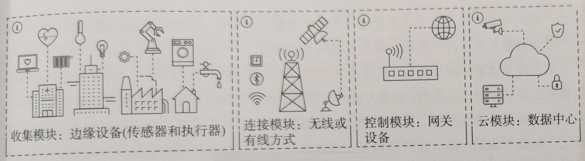
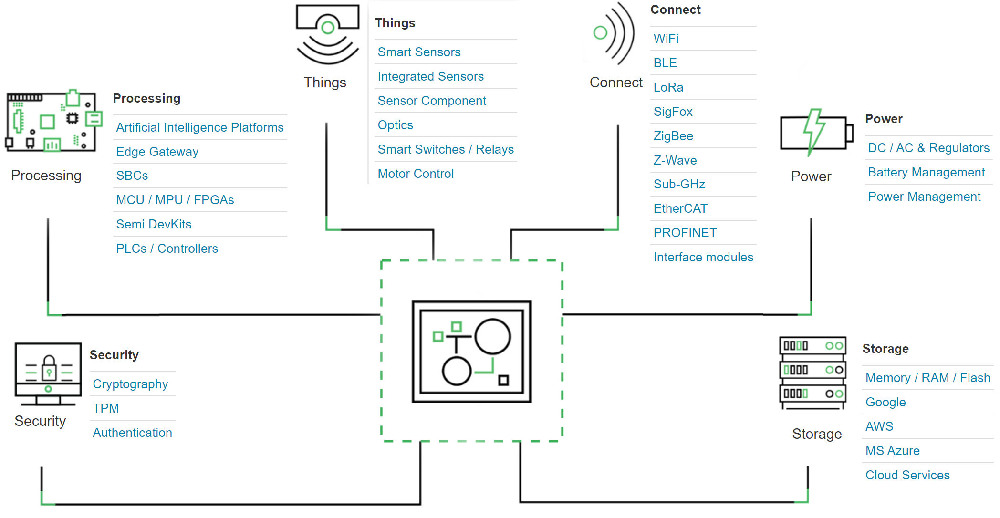

# IOT 物联网 Internet of Things

物联网是在互联网基础上进行拓展延伸的网络，物联网使各种带有传感器的信息设备与互联网连接起来，形成更为巨大的网络，实现在任何时间、任何地点，人、机、物的互联互通。

物联网的应用将超越商用范围，而是最终会影响人们生活的方方面面，从医疗健康到家居自动化，再到汽车等。但需要统一的标准和 API，使来自不同生产厂商的各种类型的设备（传感器）都可以实现互联互通。

将物联网、云计算、大数据分析、AI、智能家居等结合起来，才能实现真正的智能。

# IOT 物联网系统组成

从宏观上看，物联网系统通常可以分成以下几个组成部分：

- 收集模块：边缘设备（传感器和执行器）。

- 连接模块：无线或有线方式。

- 控制模块：网关设备、控制主机设备等。

- 云模块：数据中心、数据存储、数据分析等。

- 安全模块：网络安全、信息安全、加密与解密等。

- 边缘计算：AIOT。

  

## 收集模块：边缘设备（传感器和执行器）

物联网中的每一台设备都需要有传感器，传感器，可以提供一些信息。例如，电视是开着还是关着、冰箱是满的还是空的。

### IOT 与 低功耗

越来越多的物联网设备采用电池供电，这时，低功耗的需求就会特别突出。

### IOT 与 微控制器

物联网中的每一台设备都需要有微控制器来读取传感器数据，并与其他设备通信，并执行某些任务。微控制器需要足够小、便宜、低功耗。

## 连接模块：无线或有线方式

### IOT 与 无线通信

物联网中的每一台设备都需要与其他设备进行通信，不仅包括局域网内部的通信，还包括 Internet 的通信。

## 控制模块：网关设备、控制主机设备等。

## 云模块：数据中心、数据存储、数据分析等

## 安全模块：网络安全、信息安全、加密与解密等

## 边缘计算：AIOT

# IOT 物联网平台

# IOT 与 AI、云计算、大数据分析

随着数以亿计的设备连接到物联网，物联网将产生大量的数据，这些数据无法用常规方法进行存储和分析。这就是为什么需要云计算来存储、分析和显示数据的原因。

例如，不仅需要通过传感器知道冰箱是满的还是空的，还需要知道目前冰箱里面具体存放了哪些食品（包括存放的时间、是否变质等），还需要与个人的健康和营养的数据分析联系在一起。

# IOT 与 工业 4.0

每一次工业革命都会显著提高生产力。

- 第一次工业革命：18 世纪，当时蒸汽机使工业生产发生了革命。

- 第二次工业革命：19 世纪，当时电力和装配线使大规模生产成为可能。

- 第三次工业革命：20世纪，电子和计算机使自动化生产成为可能。也称为数字革命。

- 第四次工业革命：即将到来。物联网的工业版被称为工业 4.0——第四次工业革命。

# 车联网

# 万物互联

2018 年，互联网公司开始助攻传统行业（流量时代的终结，思路转变，明天的路要往哪里走。）。与此同时，“数字经济” 被写入政府工作报告，以数字化转型整体驱动生产方式、生活方式、治理方式变革。

2018 年，阿里宣布将全面进军万物互联领域，腾讯进行组织架构调整（即 “930” 改革），并把 “产业互联网” 第一次提到案头的重心。

产业互联网拥有更广阔的发展空间，制造、能源、电力、交通、政务等等，都是万亿级的市场。若进行数字化转型，内部完成全面在线，外部适应各种变化，从前端到后端，全面实现无需人工介入的自动化和智能化，全行业将会发生结构性的改变。

上海一直是数字中国战略的先行者，也是首个获得 “世界智慧城市大奖” 的国内城市。2019 年 11月，上海发布《上海市全面推进城市数字化转型 “十四五” 规划》，主要包括：

- 经济领域数字化转型。包括科创生态、金融新科技、商务新业态、航运新枢纽、在线新经济、制造新模式、农业新面貌。
- 生活领域数字化转型。包括健康新服务、成长新空间、居住新家园、出行新方式、文旅新风尚、消费新体验、扶助新模式、数字无障碍新环境。
- 治理领域数字化转型。包括政府服务新体系、城市运行新韧性、经济监管新能效、社会治理新成效、智慧政法新应用。

